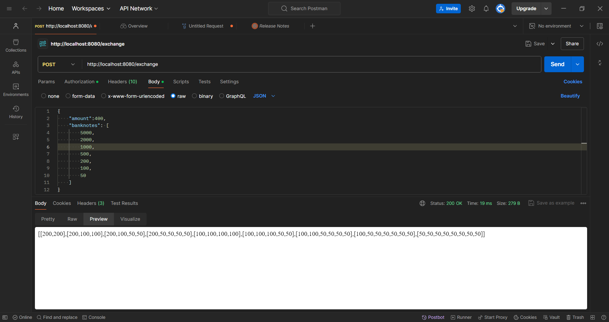

# Test task 


**Задачи:**

Exchanges

Написать REST сервис по расчету всех вариантов размена для указанной суммы денег. На вход принимается HTTP запрос в формате:

{
"amount": 400,
"banknotes": [
5000,
2000,
1000,
500,
200,
100,
50
]
}

где amount – сумма денег, banknotes – доступные номиналы банкнот


Формат ответа:

{
"exchanges": 
- [200, 200],
- [200, 100, 100],
- [200, 100, 50, 50],
- [200, 50, 50, 50, 50],
- [100, 100, 100, 100],
- [100, 100, 100, 50, 50],
- [100, 100, 50, 50, 50, 50],
- [100, 50, 50, 50, 50, 50, 50],
- [50, 50, 50, 50, 50, 50, 50, 50]

}

**Требования к оформлению**
- конфигурация (хост, порт, уровень логирования)
- graceful shutdown
- unit тесты алгоритма
- оформлен в общедоступном git репозитории


## Результат

- реализовал конфигурацию
```
Host : localhost
Port : 8080
Loglevel: INFO
```
- graceful shutdown в handler.go
- написал unit test для алгоритма

## Как запустить сервис?

1. Клонируем репозиторий:
```
git clone https://github.com/instinctG/exchanges.git
```
2. Запуск сервера:

```
make server
```

### Команды
 Проверить на тесты:
```
make test
```

Завершить сервер:
```
Ctrl + C
```

### Эндпоинт

Токены:

- POST /exchange

### Пример ответa API:

Использовал Postman.

POST   /exchange
